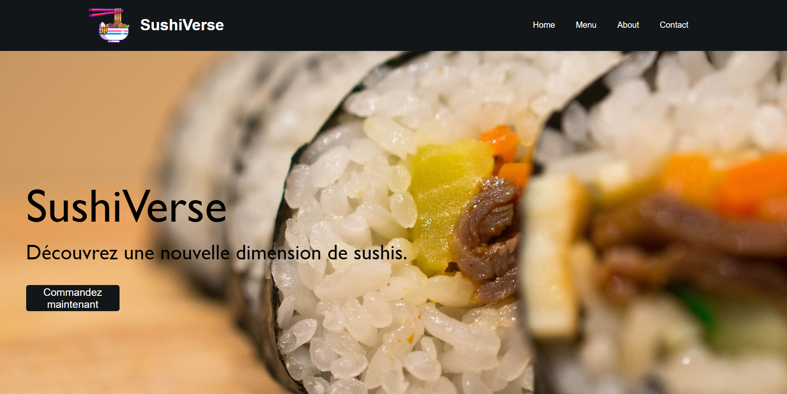
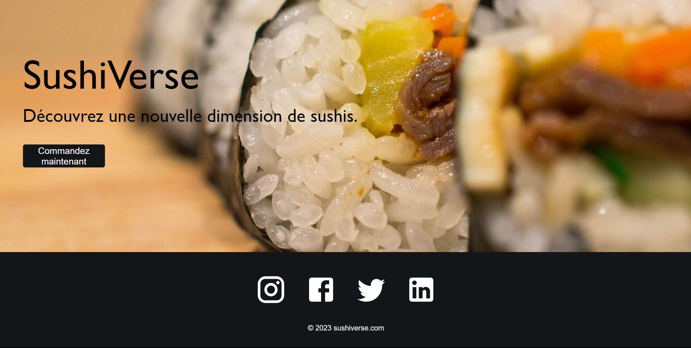
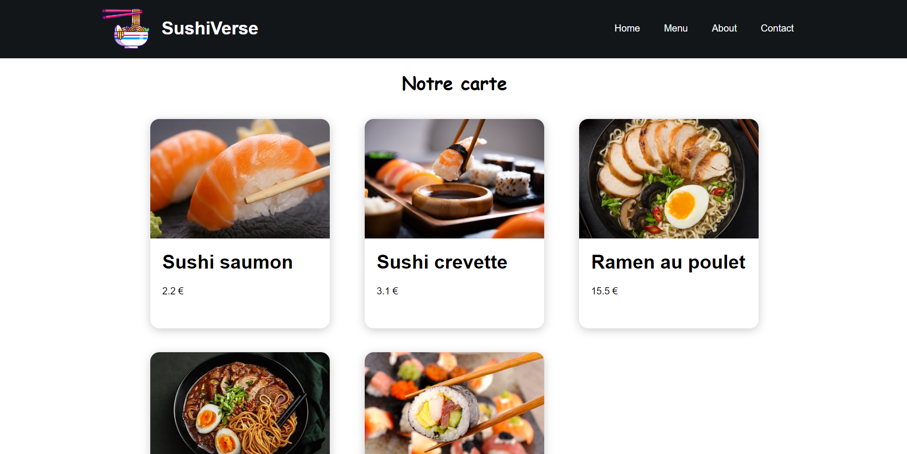
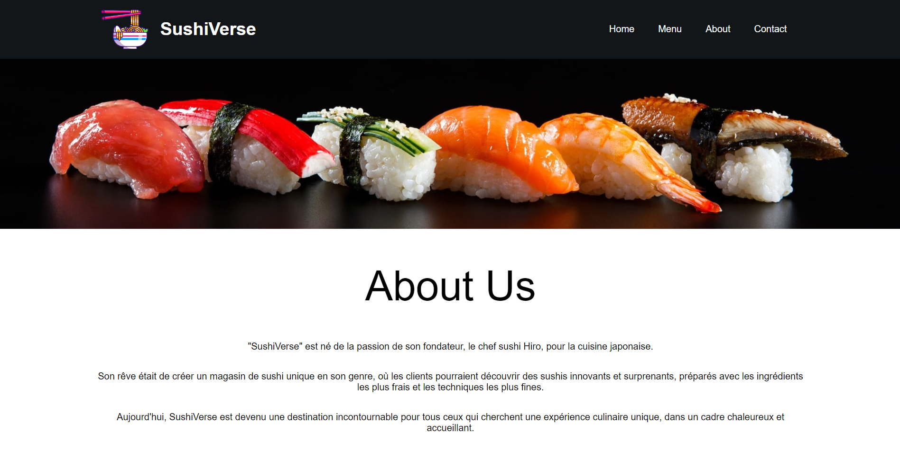
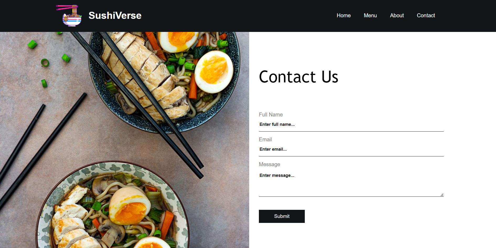

# SushiVerse
Site vitrine d'un sushi shop fictif développé en ReactJS.

Pour tester, il suffit d'installer les dépendances avec `npm install` puis de lancer le serveur avec `npm start`.

---

## Screenshots

